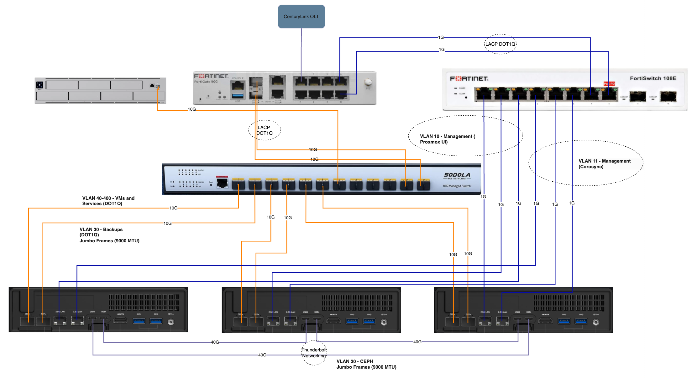

# Home lab architecture and setup. 

  <strong>⚠ Note:</strong> This is a work in progress; the project was started on 2-20-2025.

 
 
This repo will track the equipment, architecture, setup, performance tuning, and performance metrics of my homelab/DC. It will satisfy the use cases below. Because this is a home lab, I call this labbing on a budget. While it can certainly be stood up with less expense my goal is to balance cost/performance.  
 
**Business Requirements:**

- Leverage existing equipment where possible and keep cost balanced when procuring new hardware.
- Outside of hardware failures, it must support the lab environment for the next ~10 years.
- Replace subscription services (e.g., iCloud, OneDrive, Zoom, etc.).
- Must provide a flexible environment capable of hosting POCs for Networking, Software, and Systems.
- Must not leverage any subscription services to maintain. 

**Functional Requirements:**

- Must be able to host video, music, files, photos (i.e., a iCloud, OneDrive, Google Drive, Dropbox replacement) for Mac, Windows, and iPhones.
- Must support containers and container orchestration (e.g., Docker, Podman, Kubernetes, LXC, etc.) for a variety of workloads (Python / FastAPI, Node, PostGRES, Influx, NGINX, DNS, Grafana, etc.).
- Must be able to host a variety of VMs (e.g., Windows, Ubuntu, CentOS, Vendor Software).
- Data must survive any single failure (Compute, Storage, Network).
- Data must survive power outages.
- Must be able to run Containerlab (Network models) at scale. 
- Must provide live VM migrations.
- Must maintain low noise as it will run in an office (i.e., no server jet engines).
- Must be secure. 

# Table of Contents:
1. [High Level Architecture](#Architecture)  
2. [Hardware](#Hardware)
3. [Storage](#Storage)
4. [Networking](#Networking)

## High Level Architecture

The setup will consist of a three node [Proxmox Virtual Environment](#https://www.proxmox.com/en/products/proxmox-virtual-environment/overview) cluster and a NAS. This will allow the setup to horizontally scale by adding additional compute and storage as required. Each node will be staged as followed:

- 3 X 2TB M.2 NVMe SSDs
- 2 X 48G DDR5 RAM
- 2 X 10G MM SFP+
- 2 X 1G Ethernet

Reference the granular networking and storage details below. 

## Hardware

I was originally going to leverage existing eBay purchased HP, Dell, and Micro servers that I have on hand but, even with noise canceling headphones and the desire for a space heater, they do not meet the noise/power requirements. 

I've procured all hardware below with the exception of the Fortigate 90G for which i'm currently using a Fortigate 61F in its place (If anyone wants to send me a Fortigate 90G, I'd be happy to test it for you).

| Item | Description | Qty | Costs | Total | Link |
|------|------------|-----|-------|-------|------|
| **MINISFORUM MS-01** | Mini PC | 3 | $671.99 | $2015.97 | [Amazon](#) |
| **Crucial 48GB DDR5 RAM 5600MHz** | RAM | 6 | $107.98 | $647.88 | [Amazon](#) |
| **WD_BLACK 2TB SN7100 NVMe** | NVMe SSD | 9 | $139.99 | $1259.91 | [Amazon](#) |
| **Seagate IronWolf 8TB NAS Internal Hard Drive** | SATA HDD | 5 | $159.99 | $799.95 | [Amazon](#) |
| **SAMSUNG 870 EVO SATA III SSD** | SATA SSD | 2 | $89.99 | $179.98 | [Amazon](#) |
| **12 Port 10G SFP+ Smart Switch** | Network Switch 10Gbps | 1 | $219.99 | $219.99 | [Amazon](#) |
| **10Pack 10GBase-SR SFP+ Transceiver** | 10G MM SFP+ (10 Pack) | 2 | $134.41 | $268.82 | [Amazon](#) |
| **LC to LC Fiber Patch Cable** | LC to LC Fiber Patch Cable | 2 | $134.41 | $268.82 | [Amazon](#) |
| **Copper SFP** | 10Gtek SFP to RJ45 1000BASE-T Copper Transceiver | 1 | $27.00 | $27.00 | [Amazon](#) |
| **1G MM Fiber SFP** | 2 Pack 1.25G 850nm Multimode SFP LC Transceiver | 1 | $26.41 | $26.41 | [Amazon](#) |
| **Switch FAN** | Noctua NF-A4x20 FLX Computer Case Fan | 1 | $14.95 | $14.95 | [Amazon](#) |
| **UNAS Pro** | UniFi UNAS Pro | 1 | $499.00 | $499.00 | [UniFi](#) |
| **Fortigate 90G** | Firewall | 1 | - | $0.00 | - |
| **FortiSwitch 108E** | Ethernet Switch | 1 | - | $0.00 | - |
| **Maxonar [2 Pack 3.3FT] Thunderbolt 4 Cable** | Cabling | 2 | $22.99 | $45.98 | [Amazon](#) |

Less the Fortigate 61F and Fortiswitch 108E, the total cost sunk is $6274.66. Depending on your environment requirements you can certainly exchange any of the above for a far lower entry point. 

## Storage

| Storage                                  | Location                     | Purpose                         |
|------------------------------------------|------------------------------|---------------------------------|
| **Proxmox OS + VM Storage (LVM-Thin)**   | SSD 1 (NVMe 2TB per node)    | Fast local VMs                 |
| **Ceph Storage for Clustered VM Disks**  | SSD 2 (NVMe 2TB per node)    | Ceph OSD (Primary Storage)      |
| **Ceph Storage Expansion**               | SSD 3 (NVMe 2TB per node)    | Extra Ceph storage             |
| **Backups (Proxmox Backup Server or NFS)** | NAS (HDDs, RAID/ZFS)         | Efficient storage for backups  |
| **Media Store (Video, Audio, Images)**                           | NAS (HDDs, RAID/ZFS)         | High-capacity storage          |

A couple things of note:

- I went with lower cost consumer grade M.2 SSDs. These drives do not have power loss protection (PLP).
    - This could impact performance. When data is written to Ceph, it first lands on WAL (Write-Ahead Log). It is then processed and stored in RocksDB metadata. Last, it is flushed to the main data store. Since the drives do not have PLP, Ceph cannot safely flush its write cache when power is lost. This will result in: High write latency due to the disablement of write cacheing, more frequent forced syncs to storage and potential data corruption if power is lost mid-write. 
    - It could also impact the longevity of the drives due to higher Ceph OSD write amplification. 
    - I will monitor this and if performance is terrible, I will enable write caching and add a UPS along with a script that shuts down the environment upon power outage detection. 
    - If performance is still terrible, I will consider moving Ceph WAL/DB to a separate enterprise NVMe with PLP. 
    - I plan to put workloads with high I/O (e.g., Influx, PostGres) on either SSD1 (LVM-Thin) or potentially move SSD 3 to ZFS. 

## Networking

| VLAN  | Purpose                     |
|-------|-----------------------------|
| **VLAN 10** | Management (Proxmox UI) |
| **VLAN 11** | Management (Corosync), CEPH Contorl Plane   |
| **VLAN 20** | Ceph Storage            |
| **VLAN 30** | Backups                  |
| **VLAN 40-400** | VMs and Services     |

The network is designed to offer a balance between cost and performance. To help achieve this, I leveraged the MS-01s USB4 / Thunderbolt ports to host the CEPH dataplane. This will provide CEPH with a 40Gbps (Real world throughput will vary but should still exceed 20Gbps) dedicated network. You'll also notice that the 10G SFP+ ports on the MS-01s are not deployed with LACP; This was purposeful because the low end hardware only supports SRC/DST hashing and I wanted to avoid Hash Polarization. VLAN 30 (e.g., backups) has its own dedicated 10G link per node to isolate the activity from active VMs/services (i.e., large backups will not complete with VM service for network performance). In addition, Corosync require low latency tolerance (<2ms is ideal, 2-5ms acceptable) and as such will receive a dedicated port on each node. 